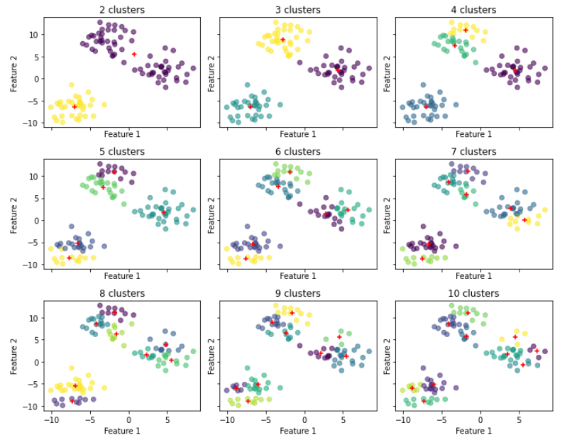

# Python Help ADA :


### Do a histogram 

You can either use the **seaborn function** 

```python
sns.histplot(data=df, x="column")
```

You can also use the `np.bincount` function. This function takes **an array x** and outputs an array b such that `b[i]` is the number of times i occurs.
So you can do a histplot by doing :

```python
values = np.bincount(x)
bins = np.arange(len(values))
plt.bar(bins, values)
```

But better : 

```python
plt.hist(values, bins=100)
```


### Plot loglog plots 

We need to plot a loglog plot. We first need to compute the bins of a histogram.

```python
n, bins, patches = plt.hist(values, log=True, bins=100, histtype="step")
```

n = height of the bins
bins = edges of the bins

Now we plot the loglog :
```python
plt.loglog(bins[1:], n)
```

TO have a steadier plot you need to use the anti-cumulative histogram i.e. :
```python
n, bins, patches = plt.hist(values, log=True, bins=1000, histtype="step", cumulative=-1)
plt.loglog(bins[1:], n)
```

### Plot heatmaps
Heatmap plots are useful to show the relationship between **2 categorical + 1 variables**. For it we need to construct a 2D dataframe, for which we can use the `crosstab` function.
```python
df = pd.crosstab(df[categorical_var1],df[categorical_var2],
                  values = df[hue_var], aggfunc='sum')
sns.heatmap(df)
```


### Statis tests:

#### Goodness of fit with a normal distribution

You want to check if `values` come from a normal distribution 

```python
from statsmodels.stats import diagnostic

ksstat, pvalue = diagnostic.kstest_normal(values, dist="norm")
```

You can also check if it fits an exponential distribution 
```python
ksstat, pvalue, diagnostic.kstest_normal(values, dist="exp")
```

In this case the NULL HYPOTHESIS is **the values are generated by this distribution**, so if p < 0.05 we reject the null hypothesis.  


#### Correlation between random variables

To test if two random variables have any relation we use the Pearson test.

```python
from scipy import stats

score, pvalue = stats.pearsonr(values1, values2)
```

The NULL HYPOTHESIS is **the two variables are independant** so if p < 0.05 then the test is significant


#### Test the difference in the mean of two random variables

```python
score, pvalue = stats.ttest_ind(values1, values2)
```

NULL HYPOTHESIS **distribution has the same mean**,, if pvalue < 0.05 we reect the null hypothesis of equal average. 


### Linear regressions


##### With sklearn


To get the actual regression 
```python
from sklearn.linear_model import LinearRegression

X = df[chosen_features].to_numpy()
y = df[to_predict]

model = LinearRegression()
model.fit(X, y)

print(model.score(X, y)) ## R_square score
print(model.intercept_) ## intercept coeff
print(model.coef_) ## coef of the regression line
```
Sklearn also features a lot of different feature calculator like `sklearn.metrics.mean_squared_error(labels_ground_truth, predicted)`.


Do the cross_validation with **precision** and **recall**.

```python
precision = cross_val_score(model, X, y, cv=10, scoring="precision")
recall = cross_val_score(model, X, y, cv=10, scoring="recall")
```


##### With SMF
There is two ways to do. One works with `statsmodel.formula.api` and works with formula for the time 
> formula = "`var ~ C(predictor1) + C(predictor2) + ... + C(predictork) + predictori:predictorj`"

- `:`: interactaction term between predictori and predictorj i.e. a term of the form $\alpha$* predictori* predictorj
- `+`: Union of term included in the model
- `*`: `a*b`= `a + b + a:b` 
- `C(var)`: to specify categorical variables


Now having the statistics of this regression yields :

```python
import statsmodel.formula.api as smf

model = smf.ols(formula="time ~ C(diabetes) + C(high_blood_pressure)", data=df)
res = model.fit() ## fits the model according to the given data

print(res.summary())
```

The summary looks like this : 
```
                            OLS Regression Results                            
==============================================================================
Dep. Variable:                   time   R-squared:                       0.040
Model:                            OLS   Adj. R-squared:                  0.033
Method:                 Least Squares   F-statistic:                     6.097
Date:                Thu, 13 Jan 2022   Prob (F-statistic):            0.00254
Time:                        15:00:11   Log-Likelihood:                -1718.9
No. Observations:                 299   AIC:                             3444.
Df Residuals:                     296   BIC:                             3455.
Df Model:                           2                                         
Covariance Type:            nonrobust                                         
===============================================================================================
                                  coef    std err          t      P>|t|      [0.025      0.975]
-----------------------------------------------------------------------------------------------
Intercept                     139.3851      6.658     20.934      0.000     126.282     152.489
C(diabetes)[T.1]                4.9059      8.949      0.548      0.584     -12.706      22.518
C(high_blood_pressure)[T.1]   -31.8228      9.247     -3.441      0.001     -50.021     -13.624
==============================================================================
Omnibus:                      159.508   Durbin-Watson:                   0.076
Prob(Omnibus):                  0.000   Jarque-Bera (JB):               18.166
Skew:                           0.076   Prob(JB):                     0.000114
Kurtosis:                       1.802   Cond. No.                         2.82
==============================================================================
```

- First thing : **the R square score** : 0.040 is low
- you got values for all of the coefficient

Here we can deduce that time = 139 + 4 * diabetes - 31.82 * high_blood_pressure, where both are binary indicators.

OLS = Ordinary least square but you can perform the same analysis with `smf.logit` to have a logistic regression


### Creating a matching in an observational study


We need to match two persons, one from the control group and the other from the treated one. We need to mathc two persons that have the closest **propensity score** as possible. That is, two persons from the two groups that seems to have, apparently, the same probability to be treated.

##### Computing the propensity score

First, do a linear regression of **all our features*** with **treated**.

```python
## what we try to do is estimate the relation between treat and all the other features
import statsmodels.formula.api as smf

model = smf.logit(formula="treat ~ age + educ + re74 + re78 + re75 + C(black) + C(hispan) + C(married) + C(nodegree)", data=df)
res = model.fit()
print(res.summary())
df["propensity_score"] = res.predict() ## this is the propensity score of each data point
```


##### Matching the points

We want to match the datapoints

```python
import networkx as nx

control = df[df.treat == 0]
treated = df[df.treat == 1]

weighted_edge_list = []
for controled_id, controled_features in control.iterrows():
    for treated_id, treated_features in treated.iterrows():
        edge_weight = 1 - np.abs(controled_features["propensity_score"] - treated_features["propensity_score"])
        weighted_edge_list.append((controled_id, treated_id, edge_weight))

G = nx.Graph()
G.add_weighted_edges_from(weighted_edge_list)

matching = nx.max_weight_matching(G)
```


### Get the ROC curve

It's pretty cumbursome to compute so you can just use

```python
from sklearn.metrics import roc_curve

fp_rate, tp_rate, _ = roc_curve(ground_truth_label, prediction)

plt.plot(fp_rate, tp_rate)
```


### Random Forests

```python
from sklearn.model_selection import train_test_split
from sklearn.ensemble import RandomForestClassifier
from sklearn.metrics import accuracy_score

## split in train and test set
X_train, X_test, y_train, y_test = train_test_split(X, y, train_size=0.8, test_size=0.2)

clf = RandomForestClassifier(n_estimators=100)
clf.fit(X_train, y_train)

accuracy_score(y_test, clf.predict(X_test))
```


And if you want to do **cross validation** on any hyper parameters (here, say, n_estimators) proceed the following way

```python
from sklearn.model_selection import cross_val_score

for estimators in [10, 50, 100, 200]:
    clf = RandomForestClassifier(n_estimators=estimators)
    scores = cross_val_score(clf, X_train, y_train, cv=5)
    print(f"For {estimators} the cross val score in {scores.mean()}")
```


### Kmeans

##### Plot bidimensional clustering

the following snippet :
```python
from sklearn.cluster import KMeans
from sklearn.metrics import silhouette_score

MIN_CLUSTERS = 2
MAX_CLUSTERS = 10

# Compute number of row and columns
COLUMNS = 3
ROWS = math.ceil((MAX_CLUSTERS-MIN_CLUSTERS)/COLUMNS)
fig, axs = plt.subplots(ROWS, COLUMNS, figsize=(10,8), sharey=True, sharex=True)

# Plot the clusters
for n_clusters, ax in zip(range(MIN_CLUSTERS, MAX_CLUSTERS+1), axs.flatten()):
    # Cluster the data with the current number of clusters
    kmean = KMeans(n_clusters=n_clusters).fit(X)
    # Plot the data by using the labels as color
    ax.scatter(X[:,0], X[:,1], c=kmean.labels_, alpha=0.6)
    ax.set_title(f"{n_clusters} clusters")
    ax.set_xlabel("Feature 1")
    ax.set_ylabel("Feature 2")
    # Plot the centroids
    for c in kmean.cluster_centers_:
        ax.scatter(c[0], c[1], marker="+", color="red")

plt.tight_layout()
```

Produces :




#### Chose the hyperparameter k

1) Maximizing the silhouette

```python
silhouettes = []

# Try multiple k
for k in range(2, 11):
    # Cluster the data and assigne the labels
    labels = KMeans(n_clusters=k).fit_predict(X)
    # Get the Silhouette score
    score = silhouette_score(X, labels)
    silhouettes.append({"k": k, "score": score})

```

2) Chosing the elbow of inertia curve

```python

intertias = []
for k in range(2, 11):
    kmeans = KMeans(n_clusters=k).fit(features_X)
    inertias.append({"k": k, "sse": kmeans.inertia_})
```


### Dimensionality reduction

#### Using TSNE

```python
from sklearn.manifold import TSNE

X_reduced_tsne = TSNE(n_components=2).fit_transform(X)
```

#### Using PCA

```python
from sklearn.decomposition import PCA

X_reduced_pca = PCA(n_components=2).fit(X).transform(X)
```

### Clustering using DBSCAN

```python
from sklearn.cluster import DBSCAN

labels = DBSCAN(eps=eps).fit_predict(X)

```

##### FInd the parameter epsilon

```python
# Create a list of eps
eps_list = np.linspace(0.05, 0.15, 14)

# Compute number of row and columns
COLUMNS = 7
ROWS = math.ceil(len(eps_list)/COLUMNS)

fig, axs = plt.subplots(ROWS, COLUMNS, figsize=(12, 4), sharey=True, sharex=True)

for eps, ax in zip(eps, axs):
    labels = DBSCAN(eps=eps).fit_predict(X)
    ax.scatter(X_moons[:,0], X_moons[:,1], c=labels, alpha=0.6)
    ax.set_title(f"eps = {round(eps, 3)}")
    
plt.tight_layout()
```

yielding :


# NLP

## Spacy 

#### Load a text into a spaCy

```python

import spacy

nlp = spacy.load("en_core_web_sm-3.2.0")

txt = "big loaded text"

doc = nlp(txt) ## transform the raw text into spacy object
```

#### Function :

1) extracting **sentences** : `doc.sents`
2) extracting **tokens** : `[token.text for token in doc]`
3) extracting **tags** : `[(token.text, token.tag_) for token in doc]` or `[(token.text, token.pos_) for token in doc]`
4) extracting **entities** : `[(entities.text, entities.label_) for entity in doc.ents]`
5) removing **stop words** : `[token.text for token in doc if token.is_stop of token.is_punct]`
6) **Lemmatisation** : `[token.lemma_ for token in doc]`

## Topic extraction with LDA

```python 
from gensim.corpora import Dictionary
from gensim.models import LdaMulticore

## docs is a list of all the document (one document being the list of preprocessed tokens)
dictionary = Dictionary(docs)

corpus = [dictionary.doc2bow(doc) for doc in docs]

## COMPUTE THE TOPICS :
model = LdaMulticore(corpus=corpus, num_topics=4, id2word=dictionary, workers=6)

## display result :
model.show_topics(num_words=5)
```


### Bootsrapping 

```python
entries = len(df.index)

## true stat
ground_truth = f(df)

computed = []
for i in range(1000):
    sel_indexes = np.random.choice(np.arange(len(df.index)), entries)
    computationdf = df.iloc[sel_indexes]

    ## computation
    computed.append(f(computationdf))


computed = [val.values[0] for val in computed]
computed.sort()
bootstrap[char] = (ground_truth - computed[25] , computed[975] - ground_truth)
```


##### Error bar graph


Suppose you have a `dict` as follows :

```python

## entries of the type : character : [value to substract, value to add]
bootstrap = {"Sheldon" : [30, 40], ...}


f, a = plt.subplots(figsize=(15, 6))
xerr = np.array(list(bootstrap.values())]).reshape(2, 19)
plt.errorbar(ground_truths, characters, xerr=xerr, linewidth = 1,
             linestyle = 'none',marker = 'o',markersize= 3,
             markerfacecolor = 'black',markeredgecolor = 'black', capsize= 5)
```


